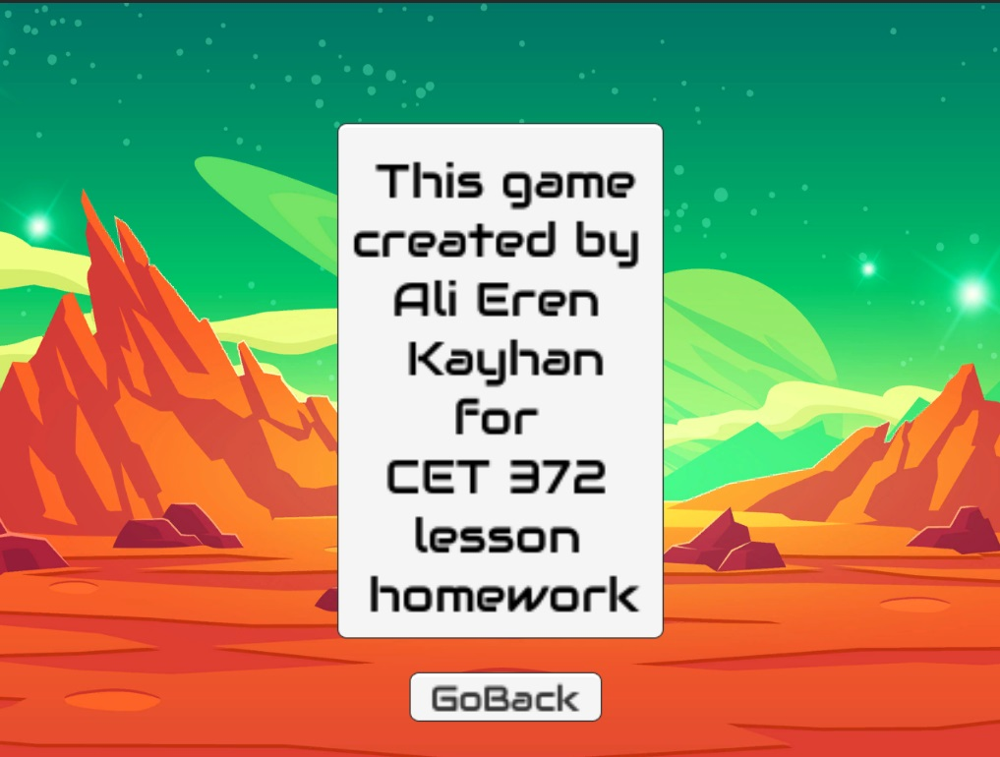

    
# Unity-my-works

This repository is for my lesson homework. Some of them need some settings because of version of unity.
 
 

## Table of Contents

* [General Info](#Unity-my-works)
* [Technologies Used](#Technologies)
* [Prerequisites](#Prerequisites)
* [Screenshots](#Screenshots)
* [Setup](#Setup)
* [Lisans](#Lisans)
* [Feedback](#Feedback)
* [Reference](#Reference)
 
## Technologies
-  
- 
- 

## Screenshots
  1-Screenshots of 2D Game scene and animation CET 341 hw
  <table> 
    <tr>
        <td>  
</td>
    </tr>
   </table>

 2-Screenshots of AliErenKayhanCET372Homework1exports
  <table> 
    <tr>
        <td>  
</td>
         <td>  
</td>
          <td>  
</td>
              <td>  
</td>
    </tr>
   </table>

 3-Screenshots of AliErenKayhanCET372Homework2
  <table> 
    <tr>
        <td>  
</td>
    </tr>
   </table>

 4-Screenshots of Hw3WasteCollect
  <table> 
    <tr>
        <td>  
</td>
    </tr>
   </table>
   
   
  5-Screenshots of CubeWorld
  <table> 
    <tr>
        <td>  
</td>
        <td>  
</td>
        <td>  
</td>
    </tr>
   </table>

## Setup  
  -Download the repositroy. 
  -Export it from zip. 
  -Select a project. 
  -Find the file which has with ".unitypackage" extension and add it to unity project. 
 
## Lisans

This project is licensed under the terms of the [MIT](https://choosealicense.com/licenses/mit/) license.

  
## Feedback

If you have any feedback, please contact me at ali_erenbatman@hotmail.com.
  
## Reference
    -https://github.com/alexandresanlim/Badges4-README.md-Profile
    -https://shields.io/
